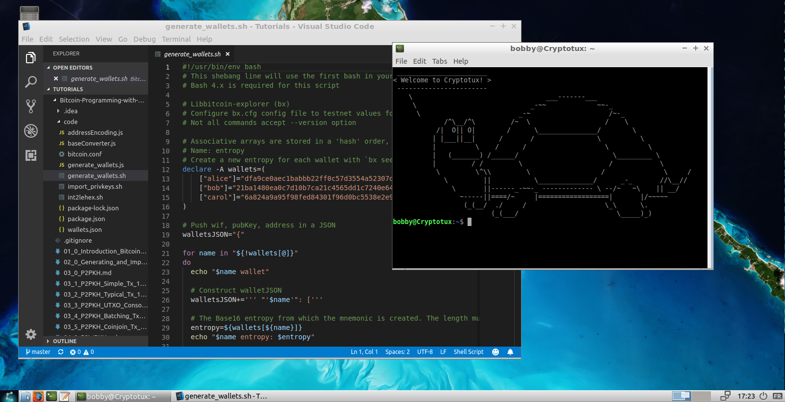

# Cryptotux

Cryptotux is a Linux image preconfigured with tools for crypto development and education.

Cryptotux is currently supplied as .ova images that can be directly imported into Virtualbox (6.X+). 
It is particularly suited for workshops. Username is *bobby*, password is *bricodeur*.

Download -> http://cryptotux.org/

## How to use it? The easy way
* Install [virtualbox](https://virtualbox.org)
* Download the desktop or server version on [cryptotux.org](https://cryptotux.org)
* Click on the file or in "import appliance" in virtualbox
* Launch from virtualbox
* For the server version, it is best to connect via ssh `ssh bobby@192.168.33.10`
* For the desktop version interact visually ! 

For ease you can also sync a local folder, let's call it remote, and the internal folder of the machine with `sshfs bobby@cryptotux-server:/home/bobby remote`

Optionnaly, add cryptotux as known hosts (on Unix systems `echo '192.168.33.10 cryptotux' | sudo tee -a /etc/hosts`). You will then be able to connect with `ssh bobby@cryptotux`

## To build from scratch

* Install vagrant and virtualbox. On a debian or ubuntu system `sudo apt install vagrant virtualbox`
* To build and run the server version `vagrant up`
* To connect to the server : `vagrant ssh`

And voilà !

* To build and run the desktop version `vagrant up cryptotux-desktop`

## Contribution
We aim to provide a useful tool and meaningful project as a collaborative effort. The first objective is to offer a standard distribution for education and development. Suggestions, remarks, partnerships and pull requests are welcome. 

* [Suggested issues](https://github.com/cryptotuxorg/cryptotux/projects/1)
* [To fork](https://github.com/cryptotuxorg/cryptotux/fork)

## Changelog
### 0.5.0 > 31 may 2019
- Fully scripted desktop 
- including java, sublime-text, artwork
- Smaller images
- added ssh password access 

### 0.4.6 > 9 may 2019
- added brave browser
- removed secondary npm packages
- lighter image

### 0.4.5 > 14 apr 2019
- added emacs
- updated go
- cosmos sdk

### 0.4.4 > 10 apr 2019
- docker tooling
- added rust & vim
- better update script 

### 0.4.3 > 9 apr 2019
- Visual code added
- updates

### 0.4.2 > 8 apr 2019
- fortune, tldr added

### 0.4.1 > 22 jan 2019
- bitcoin binaries & config
- tutorials

### 0.3 > 22 dec 2018
- Added bleachit
- Custom update scripts
- bookmarks

### 0.2
- Added parity
- Branding
- upload optimization

### 0.1.0
- Ligher image and OS
- added IPFS

### 0.0.4 > 27-Sep-2018
- Installed
	- Ganache-cli
	- Chainpoint-cli   
- Significantely lighter image

### 0.0.3 > 25-Sep-2018
- Solidity addon for Visual Code
- curl
- metamask for firefox
- node with user domain global folder (.npm-global)

### 0.0.2 > 13-Jun-2018 
- Ethereum ppa and libraries
- libssl1.0-dev

### 0.0.1
- Utilities
	build-essential libtool autotools-dev automake pkg-config libssl1.0-dev libevent-dev bsdmainutils python3 software-properties-common
	libboost-system-dev libboost-filesystem-dev libboost-chrono-dev libboost-program-options-dev libboost-test-dev libboost-thread-dev
	libminiupnpc-dev libzmq3-dev
	libqt5gui5 libqt5core5a libqt5dbus5 qttools5-dev qttools5-dev-tools libprotobuf-dev protobuf-compiler  
- Bitcoin libraries
	libdb4.8-dev libdb4.8++-dev
- Virtualbox addons

## Authors

Xavier Lavayssiere (@xavierlava)

