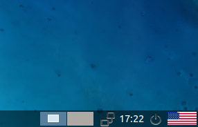

# Cryptotux

Cryptotux is a Linux image preconfigured with tools for crypto development and education.

Cryptotux is currently supplied as .ova images that can be directly imported into Virtualbox (6.X+). 
It is particularly suited for workshops. Username is *bobby*, password is *bricodeur*.


## How to use it? 

### Easy visual way with virtualbox
* Install [virtualbox](https://virtualbox.org) (and activate VT-x/AMD-V in the BIOS if needed)
* Download the latest "Desktop image" on [cryptotux.org](https://cryptotux.org)
* Click on the file or in "↶ import appliance" in virtualbox
* Press "Start ➡️" on virtualbox 

Keyboard layout, and screen resolution, can be changed by clicking on the icons at the bottom. Left click the flag to go through default options: US, FR, ES, US Mac. Right click and then "keyboard layout handler" to add more options.



### Server launch with virtualbox
To launch only nodes or tooling you can use the server version.
* Install [virtualbox](https://virtualbox.org)
* Download the latest "Server image" on [cryptotux.org](https://cryptotux.org)
* Click on the file or on "↶ import appliance" in virtualbox
* Connect via ssh `ssh bobby@192.168.33.10 ` (add `-o IdentitiesOnly=yes` if you have many keys) <!-- or have a preview by opening a browser at http://192.168.33.10:3030 -->

For ease you can also sync a local folder, let's call it 'remote', and the internal user folder of the machine with `sshfs -o IdentitiesOnly=yes bobby@192.168.33.10:/home/bobby ~/remote`

Optionnaly, you can add cryptotux as known hosts (on Unix systems `echo '192.168.33.10 cryptotux' | sudo tee -a /etc/hosts`, you will then be able to connect with `ssh bobby@cryptotux`) or add the following lines to the ssh config file, usually located on Unix systems at `~/.ssh/config`:
```
Host cryptotux
   HostName 192.168.33.10
   User bobby
   IdentitiesOnly yes
```

### Installation on top of an existing configuration
If you have Ubuntu installed (on a server, a laptop or on Windows Linux Subsystem) you can apply directly the install script to have the basic nodes and command line tooling. Don't do this on a production machine
```bash
bash <(curl -s https://raw.githubusercontent.com/cryptotuxorg/cryptotux/master/install-server.sh)
```
It has been tested on Ubuntu 20.04. It should work on any Ubuntu based distribution and it can work on Debian 10 with minor changes (docker repository and adding current user to /etc/sudoers).

### To build images from scratch

* Install [vagrant](https://www.vagrantup.com/downloads.html) and virtualbox. 
* To build and run the server version `vagrant up`
* To connect to the server : `vagrant ssh`

And voilà !

To build and run the desktop version `vagrant up desktop` or run the command `cryptotux-desktop` within the default virtual machine. This desktop build is meant for educational purposes.

## Contribution
We aim to provide a useful tool and meaningful project as a collaborative effort. The first objective is to offer a standard distribution for education and development. Suggestions, remarks, partnerships and pull requests are welcome. 

* [Suggested issues](https://github.com/cryptotuxorg/cryptotux/projects/1)
* [To fork](https://github.com/cryptotuxorg/cryptotux/fork)

There are two sets of installation scripts:

* install-*.sh are bash installation scripts. They can be applied to a local installm a server or a vagrant box
* flavours/ contains Ansible playbooks and several flavours of cryptotux

Provided ova images are built from the vagrantfile using bash scripts.

## Authors

Xavier Lavayssière ([:octocat:](https://github.com/Xalava) [🐦](https://twitter.com/XavierLava))

Alexandre Kurth ([:octocat:](https://github.com/kurthalex) [🐦](https://twitter.com/kurthalex))