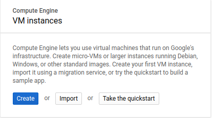
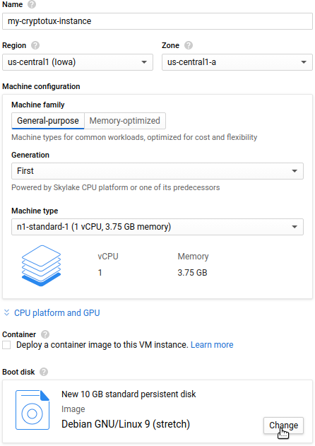
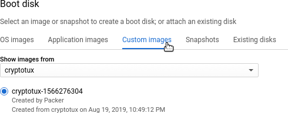

### Run Cryptotux on Google Cloud Platform

Cryptotux is not (yet?) on Google compute engine official marketplace. But don't worry you can still run Cryptotux on Google Cloud platform, as a custom image. 

#### Pre-requisites: 

* An existing project on Google Cloud Platform. If not, create one. 
* [packer](https://www.packer.io/downloads.html) installed on your system

#### Deploying steps:

* Go to your Google account and export your [JSON credentials file](https://cloud.google.com/iam/docs/creating-managing-service-account-keys), with [ the necessary roles](https://www.packer.io/docs/builders/googlecompute.html#running-without-a-compute-engine-service-account). Name it gcp-account.json, place it in this folder or change the path in the deploy-cryptotux-server-gcloud.json file.

* Enable Google compute engine API by going on this link 
[https://console.developers.google.com/apis/api/compute.googleapis.com/landing?project=YOUR_GCP_PROJECT](https://console.developers.google.com/apis/api/compute.googleapis.com/landing?project=YOURGCPPROJECT). Replace 'YOURGCPPROJECT' by the name of your project.

* Build cryptotux custom image on your google cloud platform account 

    packer build deploy-cryptotux-server-gcloud.json

* Go to Compute Engine and create a VM Instance 

* Change the boot disk

* Choose the boot disk you just built and deploy the server. Size the server with the parameters of your choice, as usual. 

