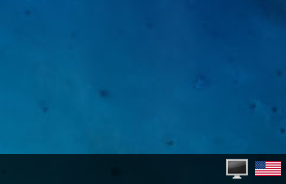

# Cryptotux - fr

Cryptotux est une image Linux préconfigurée pour le developpement et l'apprentissage des crypto et blockchains.

## Installation
1. Installer VirtualBox, version 6 ou plus. https://www.virtualbox.org/
2. Télécharger la dernière version de Cryptotux (version **desktop**) dans l'onglet "Release" de Github.
3. Charger l'image depuis virtualbox (importer une image)
4. Lancer l'image (fleche verte)
5. Il est possible que vous ayez un message d'erreur indiquant que la virtualisation n'est pas activée (VT-x). Dans ce cas, il faut redemarrer l'ordinateur, afficher les parametres du BIOS (F12,F10 ou ESC au demarrage) et activer l'option
6. Dans la version **desktop** Vous pouvez basculer sur le clavier français en cliquant en bas à droite (et clic droit pour mettre le clavier français prioritairement)
7. Vous pouvez aussi vous connecter via
- ssh `ssh bobby@192.168.33.10 `, mot de passe *bricodeur*
- un navigateur à l'adresse http://192.168.33.10:3310

