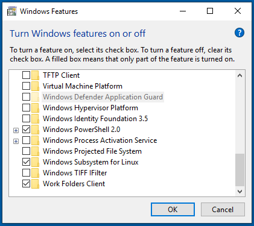

## 1. Install Windows Subsystem for Linux 

Open a Powershell in **admin mode**
```Powershell
dism.exe /online /enable-feature /featurename:Microsoft-Windows-Subsystem-Linux /all /norestart
```

Graphically you can use "Windows Features" 

 
WSL2 is highly recommanded. You can enable it if your are running Windows 10 build 19041 or higher (check with `systeminfo` in Powershell).
```Powershell
dism.exe /online /enable-feature /featurename:VirtualMachinePlatform /all /norestart
```
Then make it default an reboot
```Powershell

wsl --set-default-version 2
```

 [Microsoft documentation](https://docs.microsoft.com/en-us/windows/wsl/install-win10)


## 2. Download Ubuntu
On Microsoft store, install Ubuntu 20.04 LTS

## 3. Installation
It is advisable to extend sudo authorisation as the installation might take long. Type `sudo visudo` and add the following line to extend sudo timeout to 30 minutes
```
Defaults:USER timestamp_timeout=30
```
or add the following line to remove the need for a password
```bash
%sudo   ALL=(ALL:ALL) NOPASSWD:ALL
```
Finally, install

```bash
bash -x <(curl -sL https://cryptotux.org/install)
```
## Troubleshooting

### Temporary fix for WSL1 and Ubuntu 20.04
Source : https://github.com/microsoft/WSL/issues/5125
```bash
sudo apt install software-properties-common
sudo add-apt-repository ppa:rafaeldtinoco/lp1871129
sudo apt update
sudo apt install libc6=2.31-0ubuntu8+lp1871129~1 libc6-dev=2.31-0ubuntu8+lp1871129~1 libc-dev-bin=2.31-0ubuntu8+lp1871129~1 -y --allow-downgrades
sudo apt-mark hold libc6
```
